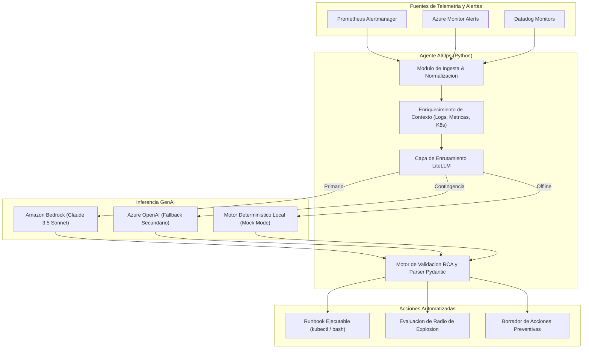

# Copiloto de Triaje de Incidentes SRE con LiteLLM y Amazon Bedrock


Agente inteligente de **Respuesta a Incidentes (AIOps)** disenado para operaciones de Ingenieria de Confiabilidad de Sitios (SRE). Ingesta alertas de produccion (compatibles con Prometheus Alertmanager, Azure Monitor y Datadog), correlaciona metricas, logs y eventos de Kubernetes, y utiliza **LiteLLM** conectado a **Amazon Bedrock (Anthropic Claude 3.5 Sonnet / Claude 3 Haiku)** para determinar la causa raiz tecnica (RCA) y emitir un runbook ejecutable de remediacion inmediata.

---

## Arquitectura de Diagnostico



---

## Escenarios de Incidentes Preconfigurados

El repositorio incluye un catalogo de incidentes reales modelados a partir de fallos criticos comunes en microservicios cloud-native:

| Clave del Escenario | Titulo del Incidente | Sintomas Observados | Causa Raiz Aislar |
| :--- | :--- | :--- | :--- |
| `oom-killed` | Desbordamiento de memoria en Pagos | Reinicio ciclico (12 restarts en 15m), Exit Code 137. | Fuga de memoria heap por payloads masivos que exceden el limit de 512Mi. |
| `db-connection-pool` | Saturacion de Pool PostgreSQL | P99 sube de 45ms a 4.8s, errores HTTP 504 Gateway Timeout. | HPA escalo pods de 3 a 6, agotando el maximo de conexiones del motor de datos. |
| `canary-500-cascade` | Regresion post-despliegue Canary | Aumento abrupto al 15% de fallos 500 en Checkout. | Excepcion no controlada por propiedad indefinida en commit v2.14.0. |

---

## Requisitos Previos

- Python 3.10 o superior.
- Credenciales de AWS con permisos en Amazon Bedrock (`bedrock:InvokeModel`) o ejecucion en modo simulacion local (`BEDROCK_MOCK=true`).

---

## Instalacion y Puesta en Marcha

### 1. Clonar el Repositorio
```bash
git clone https://github.com/NeoScraids/bedrock-incident-copilot.git
cd bedrock-incident-copilot
```

### 2. Configurar Entorno Virtual
```bash
python -m venv venv

# En Linux / macOS:
source venv/bin/activate

# En Windows (PowerShell):
.\venv\Scripts\Activate.ps1

pip install -r requirements.txt
```

### 3. Configuracion de Variables de Entorno
Copia la plantilla `.env.example`:
```bash
cp .env.example .env
```

Variables disponibles:
```env
LLM_MODEL=bedrock/anthropic.claude-3-5-sonnet-20240620-v1:0
BEDROCK_MOCK=true
AWS_REGION_NAME=us-east-1
AWS_ACCESS_KEY_ID=
AWS_SECRET_ACCESS_KEY=
```

---

## Ejecucion de Simulaciones CLI

### Simular Incidente de Memoria (OOMKilled)
```bash
python simulate_incident.py --scenario oom-killed
```

### Simular Incidente de Base de Datos (Pool Exhaustion)
```bash
python simulate_incident.py --scenario db-connection-pool
```

### Simular Falla en Despliegue Canary
```bash
python simulate_incident.py --scenario canary-500-cascade
```

### Ejecutar Todos los Escenarios Consecutivamente
```bash
python simulate_incident.py --scenario all
```

---

## Ejemplo de Salida del Agente

```text
===========================================================================
  ALERTA RECIBIDA: [P1-Critica] INC-2026-001
===========================================================================
Servicio:   payments-processor
Origen:     Prometheus Alertmanager | Entorno: production
Titulo:     Microservicio de Pagos experimenta reinicios continuos (OOMKilled)
Resumen:    La tasa de reinicios del pod payments-processor supero el umbral critico (12 reinicios en 15 min).

Metricas Clave:
  - memory_usage_bytes: 536870912 / 536870912 (100% del limit 512Mi)
  - failed_transactions_per_second: 128.5
  - pod_restarts_15m: 12

===========================================================================
  DIAGNOSTICO Y PLAN DE REMEDIACION GENERADO
===========================================================================
ID Incidente:        INC-2026-001
Severidad Evaluada:  P1-Critica
Indice de Confianza: 98%

Radio de Explosion (Blast Radius):
  Procesamiento de pagos por lotes degradado. 128 transacciones fallidas por segundo y reinicio ciclico de pods.

Analisis Causa Raiz (RCA):
  El microservicio payments-processor sufrio un desbordamiento de memoria heap (java.lang.OutOfMemoryError) durante la ingesta de cargas de 4.2MB, excediendo el limite estricto de contenedor fijado en 512Mi. El kernel de Linux envio la senal SIGKILL (Exit code 137) provocando CrashLoopBackOff.

Plan de Mitigacion Inmediata (Runbook):

  [Paso 1] Aumentar temporalmente el limite de memoria del pod a 1024Mi para mitigar la cascada de reinicios
  Comando: kubectl patch deployment payments-processor -n production --patch '{"spec":{"template":{"spec":{"containers":[{"name":"payments-processor","resources":{"limits":{"memory":"1024Mi"},"requests":{"memory":"512Mi"}}}]}}}}'
  Resultado Esperado: Los nuevos pods alcanzan estado Running (1/1) sin terminaciones OOMKilled.

  [Paso 2] Reiniciar progresivamente el despliegue para limpiar contenedores bloqueados
  Comando: kubectl rollout restart deployment/payments-processor -n production
  Resultado Esperado: Rollout progresivo sin tiempo de inactividad completado.

Medidas Preventivas Post-Mortem:
  - Implementar paginacion y streaming en la ingestion de pagos para limitar tamano maximo de payloads a 500KB.
  - Configurar Horizontal Pod Autoscaler (HPA) con metrica de utilizacion de memoria al 75%.
  - Establecer alertas tempranas de Prometheus con umbral al 85% del memory limit.
```

---

## Ejecucion en Docker

Para ejecutar el agente dentro de un contenedor aislado:

```bash
docker build -t neoscraids/bedrock-incident-copilot:1.0.0 .
docker run --rm neoscraids/bedrock-incident-copilot:1.0.0 --scenario oom-killed
```

---

## Licencia

Distribuido bajo licencia MIT. Consulta el archivo `LICENSE` para mas informacion.
